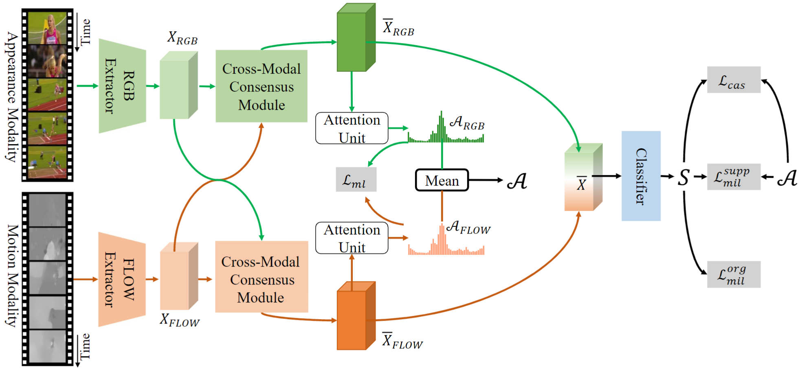

# Cross-modal Consensus Network for Weakly Supervised Temporal Action Localization (ACMM MM 2021)

[Fa-Ting Hong](https://harlanhong.github/io/)^, [Jia-Chang Feng](https://kiwi-fung.win)^ [Dan Xu](https://www.danxurgb.net), [Ying Shan](https://scholar.google.com.hk/citations?user=4oXBp9UAAAAJ&hl=zh-CN), and [Wei-Shi Zheng](http://www.isee-ai.cn/~zhwshi/). `^Equation Contribution`



### [Project](https://harlanhong.github.io//publication/co2net) | [Paper](https://arxiv.org/abs/2107.12589) 


We propose **CrOss-modal cOnsensus NETwork  (CO2-Net)**, 
which introduces two identical proposed cross-modal consensus modules (CCM) that design across-modal attention mechanism to filter out the task-irrelevantinformation redundancy using the global information from themain modality and the cross-modal local information from theauxiliary modality.


## Requirements
* Create the anaconda environment as what we used.

```
conda env create -f environment.yaml
```

* Python 3.6 and [Pytorch](https://pytorch.org/) 1.3.0 are used. Basic requirements are listed in the 'requirements.txt'.

```
pip install -r requirements.txt
```


## Quick Start
* Download the pre-trained [checkpoints](https://hkustconnect-my.sharepoint.com/:f:/g/personal/fhongac_connect_ust_hk/ErOps9s9Dq5JrtSc9cLINGsBiw04J3v_1fuVJ_VFFkLerQ?e=18eWN9).

* Create the default folder ```./ckpt``` and put the downloaded pre-trained models in ```./ckpt```.

* Run the test scripts:
``` bash
python main.py --max-seqlen 500 --lr 0.00005 --k 7 --dataset-name Thumos14reduced --path-dataset path/to/Thumos14 --num-class 20 --use-model CO2  --max-iter 5000  --dataset SampleDataset --weight_decay 0.001 --model-name CO2_3552 --seed 3552 --AWM BWA_fusion_dropout_feat_v2
```


## Prepare DataSet
The features for Thumos14 and ActivityNet1.2 dataset can be downloaded [here](https://rpi.app.box.com/s/hf6djlgs7vnl7a2oamjt0vkrig42pwho). The annotations are included with this package.

## Train Your Own Model
* Run the train scripts:
``` bash
python main.py --max-seqlen 500 --lr 0.00005 --k 7 --dataset-name Thumos14reduced --num-class 20 --use-model CO2  --max-iter 20000  --dataset SampleDataset --weight_decay 0.001 --model-name CO2 --seed 3552 --AWM BWA_fusion_dropout_feat_v2
```

## Citation

```
@InProceedings{hong2021cross,
author = {Hong, Fa-Ting and Feng, Jia-Chang and Xu, Dan and Shan, Ying and Zheng, Wei-Shi},
title = {Cross-modal Consensus Network for Weakly Supervised Temporal Action Localization},
booktitle = {ACM International Conference on Multimedia (ACM MM)},
year = {2021}
}
```
